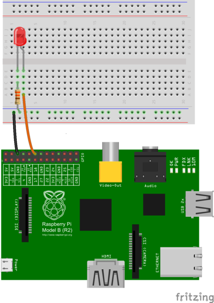

# Getting Started

## About the examples

### Assumptions

The RPi library allows two modes.  The code in this repository prefers the BOARD numbering for simplicity of learning and compatiblity across multiple versions of Raspberry Pi hardware.

    GPIO.setmode(GPIO.BOARD)

# Examples

## Example 2 - LED

## Example 3 - LED w/button

## Example 4 - 3 LEDs with button

* Pin 6 (ground) on pi to negative channel on breadboard
* Jumper from negative to row 23
* button straddles row 23 and 25
* row 25 to pin 16 on pi

# LED 1
* Pin 8 on pi to row 5 on breadboard
* Resistor from negative to row 4
* LED from row 4 (-)  to row 5 (+) (positive=long)

# LED 2
* Pin 10 on pi to row 10 on breadboard
* Resistor from negative to row 9
* LED from row 9 (-)  to row 10 (+) (positive=long)

# LED 3
* Pin 12 on pi to row 15 on breadboard
* Resistor from negative to row 14
* LED from row 14 (-)  to row 15 (+) (positive=long)

